# boardsmemberportal

A modern board member portal built with Laravel 12, Tailwind CSS, Axios, and jQuery. Features a comprehensive role-based access control system, document management, user management, and real-time communication tools.

## 🚀 Tech Stack

- **Backend:** Laravel 12
- **Frontend:** Tailwind CSS v4, HTML5, JavaScript
- **AJAX:** Axios, jQuery
- **Notifications:** SweetAlert2
- **Database:** MySQL
- **RBAC:** Spatie Laravel Permission
- **PDF Generation:** barryvdh/laravel-dompdf
- **Icons:** Font Awesome

## ✨ Key Features

### 🔐 Authentication & Authorization
- **Role-Based Access Control (RBAC)** using Spatie Laravel Permission
- Dynamic role creation and permission management
- Permission matrix interface for role assignment
- Individual user permission override system
- Single-device login enforcement
- Online status tracking with auto-logout after 30 minutes of inactivity
- Session management and activity tracking

### 👥 User Management
- **CONSEC Account Management** - Full CRUD for CONSEC accounts with individual permission control
- **Board Member Management** - Complete management system for board members
- **Pending Registrations** - Review and approve/disapprove new user registrations
- Multi-step registration forms with PSGC (Philippine Standard Geographic Code) address fields
- Profile picture upload and management
- Account activation/deactivation with audit logging

### 📄 Document Management
- **Board Resolutions** - Create, edit, view, and manage board resolutions with version history
- **Board Regulations** - Complete CRUD with versioning and change notes
- **Board Issuances** - Public-facing page displaying both resolutions and regulations
- PDF document viewer with full-screen modal
- Document history tracking with version comparison
- Change notes for document edits

### 🏛️ Government Agencies
- Government agency management with CRUD operations
- Bulk operations (activate, deactivate, delete)
- Status toggle functionality
- DataTables with search and filtering

### 📚 Media Library
- Drag & drop file upload
- Support for images, PDFs, audio, and video files
- File preview and download
- Attachment details modal
- PDF preview with download and open in new tab options

### 📊 Audit Trail
- Comprehensive audit logging for all system actions
- Searchable audit logs with DataTables
- PDF export with filtered results
- Detailed action tracking (create, update, delete, login, logout, etc.)
- IP address and user agent tracking

### 🔔 Notifications System
- In-app notification system
- Real-time notification badges
- Notification dropdown in admin header
- Unread notification count
- Notification filtering (all, unread, read)
- Auto-notification for pending registrations

### 💬 Messaging & Chat
- **Real-time Chat System** - Full-featured messaging interface for both users and admins
- **Direct Messages** - One-on-one conversations between users
- **Group Chats** - Create and manage group conversations with multiple members
- **Group Management** - Add/remove members, assign/revoke admin privileges, update group info
- **Voice Messages** - Record and send voice clips with playback controls
- **Voice Playback** - Play/pause controls, speed adjustment (1x, 1.25x, 1.5x, 2x), waveform visualization
- **File Attachments** - Share images, videos, audio files, and documents
- **Image Viewer** - Full-screen image viewer with zoom, pan, and download functionality
- **Message Reactions** - React to messages with emojis (👍, ❤️, 😂, 😮, 😢, 😠)
- **Message Replies** - Reply to specific messages with threaded conversations
- **Online Status** - Real-time online/offline status indicators
- **Unread Counts** - Track unread messages per conversation
- **Conversation Search** - Search through conversations and messages
- **Chat Popup** - Quick access chat popup interface
- **Message Timestamps** - Display message timestamps and date separators

### 🗳️ Referendum System
- **Referendum Posts** - Admin can create, edit, and delete referendum posts with title, content, attachments, and expiration date
- **User Selection** - Admin can select specific users who can view and participate in referendums
- **Voting System** - Users can vote "Accept" or "Decline" (one vote per user per referendum)
- **Vote Analytics** - Admin can view total votes, accept/decline breakdown, and voter lists with profile pictures
- **Comment System** - Users can comment on referendums with unlimited nested replies (reply to replies)
- **Threaded Comments** - Facebook-style comment system with online indicators, edit/delete functionality
- **Expiration Logic** - Automatic disabling of voting and commenting when expiration date is reached
- **Access Control** - Only selected users can view, comment, and vote on referendums
- **Real-time Updates** - AJAX-based comment submission without page refresh
- **Attachment Support** - Support for images and PDFs in referendum posts

### 📢 Announcements System
- **Announcement Management** - Admin can create, edit, view, and delete announcements with rich text content
- **Rich Text Editor** - CKEditor 4.19.1 integration for formatted content creation
- **Banner Images** - Upload and display banner images for announcements
- **User Access Control** - Select specific users or roles who can view each announcement
- **Status Management** - Draft and Published status with scheduled publishing
- **Notifications** - Automatic notifications sent to selected users when announcements are published
- **Blog-Style Display** - Professional blog-style announcements page with search functionality
- **Modal View** - Facebook-style modal for viewing full announcement details
- **Landing Page Integration** - Display up to 3 latest announcements on landing page
- **Search Functionality** - Search announcements by title and content
- **Permission-Based Access** - Users only see announcements they are permitted to view

### 📋 Roles & Permissions
- Dynamic role creation
- Permission matrix interface with expand/collapse categories
- Role-based permission assignment
- Individual user permission management
- Permission categories:
  - User Management
  - Board Member Management
  - CONSEC Account Management
  - Board Resolutions
  - Board Regulations
  - Government Agencies
  - Media Library
  - Audit Logs
  - Roles & Permissions
  - Content Management
  - Attendance Confirmation
  - Reference Materials
  - Request for Inclusion in the Agenda
  - Report Generation
  - Referendum

### 📱 Responsive Design
- Fully responsive across all devices (mobile, tablet, desktop)
- Mobile-first approach
- Touch-friendly interfaces
- Responsive DataTables
- Mobile-optimized navigation
- Adaptive layouts for all screen sizes

### 🎨 UI/UX Features
- Modern, clean design with brand colors
- Light mode only for admin panel (dark mode classes removed)
- Smooth animations and transitions
- Dropdown action menus for tables
- Multi-step forms with progress indicators
- Tooltips for action buttons
- Loading states and feedback
- Consistent branding throughout

## 📋 Table of Contents

1. [System Workflow](#1-system-workflow)
2. [Database Structure](#2-database-structure)
3. [Pages & Routes](#3-pages--routes)
4. [Design Guidelines](#4-design-guidelines)
5. [Installation](#installation)

---

## 1. SYSTEM WORKFLOW

### System Flowchart

```mermaid
flowchart TD
    Start([User Visits Portal]) --> Landing[Landing Page]
    Landing --> AuthChoice{Authentication}
    
    AuthChoice -->|Login| Login[Login Form]
    AuthChoice -->|Register| Register[Registration Form]
    
    Login --> ValidateCreds{Validate Credentials}
    ValidateCreds -->|Invalid| LoginError[Show Error]
    LoginError --> Login
    ValidateCreds -->|Valid| CheckRole{Check Role & Permissions}
    
    Register --> FillForm[Fill Personal & Organization Details]
    FillForm --> PSGC[Multi-step Form with PSGC Address]
    PSGC --> PendingStatus[Status: Pending]
    PendingStatus --> AdminReview[Admin Approval Required]
    AdminReview --> Approve{Approve?}
    Approve -->|Yes| ActivateAccount[Activate Account]
    Approve -->|No| DeleteAccount[Delete Account]
    ActivateAccount --> CheckRole
    
    CheckRole -->|Admin| AdminDash[Admin Dashboard]
    CheckRole -->|CONSEC| CONSECDash[CONSEC Dashboard]
    CheckRole -->|User| UserDash[User Dashboard]
    
    AdminDash --> AdminFeatures{Admin Features<br/>Full Access}
    AdminFeatures --> UserMgmt[User Management]
    AdminFeatures --> DocMgmt[Document Management]
    AdminFeatures --> RoleMgmt[Role & Permission Management]
    AdminFeatures --> AuditLogs[Audit Logs]
    AdminFeatures --> MediaLib[Media Library]
    AdminFeatures --> GovAgencies[Government Agencies]
    AdminFeatures --> ReferendumMgmt[Referendum Management]
    AdminFeatures --> AnnouncementMgmt[Announcement Management]
    AdminFeatures --> Messaging[Messaging System]
    
    CONSECDash --> CONSECFeatures{CONSEC Features<br/>Permission-Based}
    CONSECFeatures --> UserMgmt
    CONSECFeatures --> DocMgmt
    CONSECFeatures --> AuditLogs
    CONSECFeatures --> MediaLib
    CONSECFeatures --> GovAgencies
    CONSECFeatures --> ReferendumMgmt
    CONSECFeatures --> AnnouncementMgmt
    CONSECFeatures --> Messaging
    
    UserMgmt --> CONSECAccounts[CONSEC Accounts]
    UserMgmt --> BoardMembers[Board Members]
    UserMgmt --> PendingReg[Pending Registrations]
    
    DocMgmt --> Resolutions[Board Resolutions]
    DocMgmt --> Regulations[Board Regulations]
    Resolutions --> VersionHistory[Version History]
    Regulations --> VersionHistory
    
    RoleMgmt --> CreateRole[Create/Edit Roles]
    RoleMgmt --> PermMatrix[Permission Matrix]
    
    UserDash --> UserFeatures{User Features}
    UserFeatures --> ViewAnnounce[View Announcements]
    ViewAnnounce --> AnnounceList[Announcements List Page]
    ViewAnnounce --> AnnounceModal[View in Modal]
    ViewAnnounce --> SearchAnnounce[Search Announcements]
    UserFeatures --> ViewCalendar[Activities Calendar]
    UserFeatures --> Messaging
    UserFeatures --> MeetingNotices[Meeting Notices]
    UserFeatures --> BoardIssuances[Board Issuances]
    UserFeatures --> Referendums[Referendums]
    
    Messaging --> DirectMsg[Direct Messages]
    Messaging --> GroupChat[Group Chats]
    DirectMsg --> SendMsg[Send Messages]
    DirectMsg --> VoiceMsg[Send Voice Clips]
    DirectMsg --> ShareFiles[Share Files]
    DirectMsg --> ReactMsg[React to Messages]
    DirectMsg --> ReplyMsg[Reply to Messages]
    GroupChat --> CreateGroup[Create Group]
    GroupChat --> ManageGroup[Manage Group Settings]
    GroupChat --> AddMembers[Add/Remove Members]
    GroupChat --> GroupAdmin[Assign Group Admins]
    ManageGroup --> UpdateGroupInfo[Update Group Info]
    ManageGroup --> ChangeAvatar[Change Group Avatar]
    
    BoardIssuances --> FilterDocs[Filter by Type]
    FilterDocs --> ViewPDF[View/Download PDF]
    
    Referendums --> ViewReferendum[View Referendum]
    ViewReferendum --> Vote[Vote Accept/Decline]
    ViewReferendum --> Comment[Comment & Reply]
    ViewReferendum --> ViewAttachments[View Attachments]
    
    AdminDash --> ReferendumMgmt[Referendum Management]
    ReferendumMgmt --> CreateReferendum[Create/Edit Referendum]
    ReferendumMgmt --> SelectUsers[Select Allowed Users]
    ReferendumMgmt --> ViewAnalytics[View Vote Analytics]
    ReferendumMgmt --> ManageExpiration[Manage Expiration Date]
    
    AnnouncementMgmt --> CreateAnnounce[Create/Edit Announcement]
    CreateAnnounce --> RichTextEditor[Rich Text Editor CKEditor]
    CreateAnnounce --> UploadBanner[Upload Banner Image]
    CreateAnnounce --> SelectUsersAnnounce[Select Allowed Users]
    CreateAnnounce --> SetStatus[Set Status & Schedule]
    CreateAnnounce --> SendNotif[Send Notifications]
    
    AdminDash --> AuditSystem[Audit System]
    CONSECDash --> AuditSystem
    UserDash --> AuditSystem
    UserMgmt --> AuditSystem
    DocMgmt --> AuditSystem
    RoleMgmt --> AuditSystem
    Messaging --> AuditSystem
    
    AuditSystem --> LogAction[Log Action]
    LogAction --> StoreData[Store User, IP, Timestamp]
    StoreData --> DisplayLogs[Display in Audit Logs]
    
    style Start fill:#055498,stroke:#123a60,color:#fff
    style AdminDash fill:#CE2028,stroke:#8b1519,color:#fff
    style CONSECDash fill:#FF9800,stroke:#F57C00,color:#fff
    style UserDash fill:#055498,stroke:#123a60,color:#fff
    style AuditSystem fill:#F9FAFB,stroke:#0F172A,stroke-width:2px
```



### A. User Access Flow

#### Landing Page Structure
- Public homepage with announcements and activities calendar
- Login and registration access
- Public sections: Announcements, Activities Calendar, Vision & Mission, About Us, Contact Us

#### Authentication Flow
```
Start
  └─► Landing Page
        ├─► Login
        │      ├─► Validate Credentials
        │      ├─► Check Role & Permissions
        │      ├─► Track Activity
        │      └─► Redirect to Dashboard (User/Admin)
        └─► Register
               ├─► Fill Personal & Organization Details
               ├─► Multi-step Form with PSGC Address
               ├─► Status: Pending
               └─► Admin Approval Required
```

### B. Dashboard Flow

#### User Dashboard
```
Dashboard
  ├─► Announcements (view, read more)
  ├─► Calendar (events, meetings, schedules)
  ├─► Chat Facility (direct messages)
  ├─► Meeting Notices → View → Link / Attached Files
  └─► Board Issuances → View / Download (Resolutions & Regulations)
```

#### Admin Dashboard
```
Admin Dashboard
  ├─► Statistics & Overview
  ├─► Quick Actions
  ├─► Recent Activities
  └─► System Notifications
```

### C. Document Management Flow

```
Admin → Create/Edit Document
   ├─► Board Resolution
   │      ├─► Fill Details (Title, Number, Date, Version)
   │      ├─► Upload PDF
   │      ├─► Save → Create Version History
   │      └─► Publish
   │
   └─► Board Regulation
          ├─► Fill Details (Title, Number, Effective Date, Version)
          ├─► Upload PDF
          ├─► Save → Create Version History
          └─► Publish

User → View Board Issuances
   ├─► Filter by Type (Resolution/Regulation)
   ├─► View Details
   ├─► Download PDF
   └─► View in Modal
```

### D. User Management Flow

```
Admin → User Management
   ├─► CONSEC Accounts
   │      ├─► Create/Edit Account
   │      ├─► Set Individual Permissions
   │      ├─► Activate/Deactivate
   │      └─► View Profile
   │
   ├─► Board Members
   │      ├─► Create/Edit Account
   │      ├─► Assign Government Agency
   │      ├─► Set Representative Type
   │      ├─► Activate/Deactivate
   │      └─► View Profile
   │
   └─► Pending Registrations
          ├─► Review Registration Details
          ├─► Approve → Activate Account
          └─► Disapprove → Delete Account
```

### E. Role & Permission Management Flow

```
Admin → Role & Permission Manager
   ├─► Roles Tab
   │      ├─► Create/Edit Role
   │      ├─► Assign Permissions
   │      └─► Delete Role
   │
   └─► Permissions Matrix Tab
          ├─► View All Permissions by Category
          ├─► Assign/Revoke Permissions per Role
          └─► Expand/Collapse Categories
```

### F. Referendum Flow

```
Admin → Create Referendum
   ├─► Fill Details (Title, Content, Expiration Date)
   ├─► Upload Attachments (Images, PDFs)
   ├─► Select Allowed Users
   ├─► Save → Create Referendum
   └─► Publish

User → View Referendums
   ├─► Filter by Access (Only allowed referendums visible)
   ├─► View Referendum Details
   ├─► Vote (Accept/Decline) - One vote per user
   ├─► Comment & Reply (Unlimited nesting)
   └─► View Attachments (Images, PDFs)

Admin → Manage Referendum
   ├─► View Vote Statistics (Accept/Decline counts)
   ├─► View Voter List (with profile pictures)
   ├─► View Comment Threads
   ├─► Edit/Extend Expiration Date
   └─► Delete Referendum
```

### G. Announcements Flow

```
Admin → Create Announcement
   ├─► Fill Details (Title, Rich Text Description)
   ├─► Upload Banner Image (Optional)
   ├─► Set Status (Draft/Published)
   ├─► Schedule Publish Date (Optional)
   ├─► Select Allowed Users/Roles
   ├─► Save → Create Announcement
   └─► Send Notifications to Selected Users

User → View Announcements
   ├─► Landing Page (Max 3 Latest)
   ├─► Announcements Page (All with Search)
   ├─► Filter by Access (Only permitted announcements visible)
   ├─► Search by Title/Content
   ├─► View in Modal (Facebook-style)
   └─► Click Notification → Open Modal & Mark as Read

Admin → Manage Announcements
   ├─► View All Announcements
   ├─► Edit Announcement Details
   ├─► Update Status & Schedule
   ├─► Manage Allowed Users
   ├─► Delete Announcement
   └─► View Announcement Details
```

### H. Messaging & Chat Flow

```
User/Admin → Messaging System
   ├─► Direct Messages
   │      ├─► Select User → Open Chat
   │      ├─► Send Text Messages
   │      ├─► Send Voice Messages (Record & Send)
   │      ├─► Share Files (Images, Videos, Documents)
   │      ├─► React to Messages (Emojis)
   │      ├─► Reply to Messages
   │      └─► View Message History
   │
   └─► Group Chats
          ├─► Create Group → Select Members
          ├─► Manage Group Settings
          │      ├─► Update Group Name & Description
          │      ├─► Change Group Avatar
          │      ├─► Add/Remove Members
          │      └─► Assign/Revoke Admin Privileges
          ├─► Group Admin Features
          │      ├─► Remove Members
          │      ├─► Make Members Admin
          │      └─► Update Group Info
          └─► Group Chat Features
                 ├─► Send Messages to Group
                 ├─► Send Voice Messages
                 ├─► Share Files
                 ├─► React & Reply
                 └─► View Group Members
```

### I. Audit Trail Flow

```
System Actions → Audit Logger
   ├─► Log Action (Create, Update, Delete, Login, etc.)
   ├─► Store User, IP, URL, Method, Timestamp
   └─► Display in Audit Logs Page
          ├─► Search & Filter
          ├─► View Details
          └─► Export to PDF (with filters)
```

---

## 2. DATABASE STRUCTURE

### A. Main Entities

- Users (with UUID primary keys)
- Roles & Permissions (Spatie Laravel Permission)
- Board Resolutions & Versions
- Board Regulations & Versions
- Government Agencies
- Media Library
- Audit Logs
- Notifications
- Chats/Messages
- Announcements

### B. Key Tables

#### 1. users
```sql
id (uuid, primary key)
first_name
last_name
middle_initial
email (unique)
username (unique)
password
privilege (admin, consec, user)
government_agency_id (foreign key)
representative_type (Board Member, Authorized Representative)
pre_nominal_title (Mr., Ms.)
post_nominal_title (Sr., Jr., I, II, III, Others)
post_nominal_title_custom
designation
sex
gender
birth_date
profile_picture
mobile
landline
office_address (JSON - PSGC fields)
home_address (JSON - PSGC fields)
is_active (boolean)
status (pending, approved, disapproved)
last_activity (timestamp)
is_online (boolean)
session_id
revoked_permissions (JSON)
created_at
updated_at
```

#### 2. roles (Spatie)
```sql
id
name (unique)
guard_name
created_at
updated_at
```

#### 3. permissions (Spatie)
```sql
id
name (unique)
guard_name
created_at
updated_at
```

#### 4. model_has_roles (Spatie)
```sql
role_id
model_type
model_id
```

#### 5. role_has_permissions (Spatie)
```sql
permission_id
role_id
```

#### 6. model_has_permissions (Spatie)
```sql
permission_id
model_type
model_id
```

#### 7. board_resolutions (official_documents)
```sql
id
resolution_number
title
description
version
effective_date
approved_date
pdf_file_path
change_notes (nullable)
created_by
updated_by
created_at
updated_at
```

#### 8. official_document_versions
```sql
id
official_document_id
version
effective_date
approved_date
pdf_file_path
change_notes (nullable)
created_at
```

#### 9. board_regulations
```sql
id
regulation_number
title
description
version
effective_date
approved_date
pdf_file_path
created_by
updated_by
created_at
updated_at
```

#### 10. board_regulation_versions
```sql
id
board_regulation_id
version
effective_date
approved_date
pdf_file_path
change_notes (nullable)
created_at
```

#### 11. government_agencies
```sql
id
name
code
description
is_active
created_at
updated_at
```

#### 12. media_library
```sql
id
file_name
original_name
file_type
file_size
file_path
mime_type
uploaded_by
created_at
updated_at
```

#### 13. audit_logs
```sql
id
user_id (foreign key)
action (string)
description (text)
model_type (nullable)
model_id (nullable)
ip_address
url
method
metadata (JSON)
created_at
```

#### 14. notifications
```sql
id
user_id (foreign key)
type (string)
title (string)
message (text)
data (JSON)
is_read (boolean)
read_at (timestamp)
created_at
updated_at
```

#### 15. referendums
```sql
id (uuid, primary key)
title
content (text)
attachments (JSON - array of media_library IDs)
expires_at (datetime)
created_by (foreign key to users)
deleted_at (timestamp, soft deletes)
created_at
updated_at
```

#### 16. referendum_user_access
```sql
id
referendum_id (foreign key)
user_id (foreign key)
created_at
updated_at
```

#### 17. referendum_votes
```sql
id
referendum_id (foreign key)
user_id (foreign key)
vote (accept, decline)
created_at
updated_at
```

#### 18. referendum_comments
```sql
id
referendum_id (foreign key)
user_id (foreign key)
parent_id (nullable, foreign key to referendum_comments)
content (text)
deleted_at (timestamp, soft deletes)
created_at
updated_at
```

#### 19. group_chats
```sql
id (uuid, primary key)
name
description (nullable)
avatar (nullable, foreign key to media_library)
created_by (foreign key to users)
created_at
updated_at
deleted_at (timestamp, soft deletes)
```

#### 20. group_chat_members
```sql
id
group_chat_id (foreign key)
user_id (foreign key)
is_admin (boolean, default false)
joined_at (timestamp)
created_at
updated_at
```

#### 21. messages
```sql
id
sender_id (foreign key to users)
receiver_id (nullable, foreign key to users)
group_id (nullable, foreign key to group_chats)
parent_id (nullable, foreign key to messages, for replies)
message (text, nullable)
is_read (boolean, default false)
read_at (timestamp, nullable)
created_at
updated_at
deleted_at (timestamp, soft deletes)
```

#### 22. message_attachments
```sql
id
message_id (foreign key)
media_library_id (foreign key)
created_at
updated_at
```

#### 23. message_reactions
```sql
id
message_id (foreign key)
user_id (foreign key)
reaction_type (like, love, haha, wow, sad, angry)
created_at
updated_at
unique(message_id, user_id)
```

#### 24. announcements
```sql
id
title
content (text, rich text from CKEditor)
banner_image_id (nullable, foreign key to media_library)
created_by (foreign key to users)
status (enum: draft, published)
scheduled_at (datetime, nullable)
deleted_at (timestamp, soft deletes)
created_at
updated_at
```

#### 25. announcement_user_access
```sql
id
announcement_id (foreign key)
user_id (foreign key)
created_at
updated_at
```

---

## 3. PAGES & ROUTES

### A. Public Pages

- `/` - Landing Page (Public Announcements, Activities Calendar)
- `/login` - Login Page
- `/register` - Registration Page (Multi-step form)
- `/forgot-password` - Forgot Password

### B. User Dashboard Pages

- `/dashboard` - User Dashboard (redirects to landing)
- `/profile/edit` - Edit Profile
- `/profile/view/{id}` - View Profile
- `/notifications` - Notifications Center
- `/messages` - Messages / Chat Page (User-facing)
  - `/messages/send` - Send Message (POST)
  - `/messages/conversation/{userId}` - Get Conversation (AJAX)
  - `/messages/{messageId}/reactions` - Get Message Reactions (AJAX)
  - `/messages/{messageId}/react` - Add Reaction (POST)
  - `/messages/{messageId}/unreact` - Remove Reaction (POST)
  - `/messages/groups` - Create Group Chat (POST)
  - `/messages/groups/{id}` - Get Group Details (AJAX)
  - `/messages/groups/{id}/update` - Update Group (PUT)
  - `/messages/groups/{id}/members/add` - Add Members (POST)
  - `/messages/groups/{id}/members/remove` - Remove Members (DELETE)
  - `/messages/groups/{id}/admins/assign` - Assign Admin (POST)
  - `/messages/groups/{id}/admins/revoke` - Revoke Admin (POST)
- `/board-issuances` - Board Resolutions & Regulations (Public View)
- `/announcements` - Announcements List (User-facing, Blog-style with Search)
  - `/announcements/{id}` - View Announcement
  - `/announcements/api/landing` - Get Announcements for Landing Page (AJAX, max 3)
  - `/announcements/api/{id}/modal` - Get Announcement for Modal (AJAX)
- `/referendums` - Referendums List (User-facing)
  - `/referendums/{id}` - View Referendum (with voting and comments)
  - `/referendums/{id}/vote` - Submit Vote (POST)
  - `/referendums/{id}/comments` - Get Comments (AJAX)
  - `/referendums/{id}/comments` - Post Comment (POST)
  - `/referendums/{id}/comments/{commentId}` - Update Comment (POST)
  - `/referendums/{id}/comments/{commentId}` - Delete Comment (DELETE)

### C. Admin Pages

#### Dashboard
- `/admin/dashboard` - Admin Dashboard

#### User Management
- `/admin/consec` - CONSEC Account Management
  - `/admin/consec/create` - Create CONSEC Account
  - `/admin/consec/{id}/edit` - Edit CONSEC Account
  - `/admin/consec/{id}/permissions` - Manage Individual Permissions
  - `/admin/consec/{id}/toggle-status` - Activate/Deactivate

- `/admin/board-members` - Board Member Management
  - `/admin/board-members/create` - Create Board Member
  - `/admin/board-members/{id}/edit` - Edit Board Member
  - `/admin/board-members/{id}/toggle-status` - Activate/Deactivate

- `/admin/pending-registrations` - Pending Registrations
  - `/admin/pending-registrations/{id}` - View Registration Details
  - `/admin/pending-registrations/{id}/approve` - Approve Registration
  - `/admin/pending-registrations/{id}/disapprove` - Disapprove Registration

#### Document Management
- `/admin/board-resolutions` - Board Resolutions Management
  - `/admin/board-resolutions/create` - Create Resolution
  - `/admin/board-resolutions/{id}/edit` - Edit Resolution
  - `/admin/board-resolutions/{id}/history` - View Version History
  - `/admin/board-resolutions/{id}` - Delete Resolution

- `/admin/board-regulations` - Board Regulations Management
  - `/admin/board-regulations/create` - Create Regulation
  - `/admin/board-regulations/{id}/edit` - Edit Regulation
  - `/admin/board-regulations/{id}/history` - View Version History
  - `/admin/board-regulations/{id}` - Delete Regulation

#### System Management
- `/admin/government-agencies` - Government Agencies Management
  - `/admin/government-agencies/create` - Create Agency
  - `/admin/government-agencies/{id}/edit` - Edit Agency
  - `/admin/government-agencies/bulk-delete` - Bulk Delete
  - `/admin/government-agencies/bulk/activate` - Bulk Activate
  - `/admin/government-agencies/bulk/deactivate` - Bulk Deactivate

- `/admin/media-library` - Media Library
  - `/admin/media-library/upload` - Upload Media
  - `/admin/media-library/{id}` - View/Download Media
  - `/admin/media-library/{id}/update` - Update Media Details
  - `/admin/media-library/bulk-delete` - Bulk Delete

- `/admin/roles` - Role & Permission Management
  - `/admin/roles/create` - Create Role
  - `/admin/roles/{id}/edit` - Edit Role
  - `/admin/roles/{id}/update-permission` - Update Role Permissions

- `/admin/audit-logs` - Audit Logs
  - `/admin/audit-logs/export-pdf` - Export to PDF (with filters)

- `/admin/referendums` - Referendums Management
  - `/admin/referendums/create` - Create Referendum
  - `/admin/referendums/{id}` - View Referendum (with analytics)
  - `/admin/referendums/{id}/edit` - Edit Referendum
  - `/admin/referendums/{id}/update` - Update Referendum (POST)
  - `/admin/referendums/{id}` - Delete Referendum (DELETE)

- `/admin/announcements` - Announcements Management
  - `/admin/announcements/create` - Create Announcement
  - `/admin/announcements/{id}` - View Announcement
  - `/admin/announcements/{id}/edit` - Edit Announcement
  - `/admin/announcements/{id}` - Update Announcement (PUT)
  - `/admin/announcements/{id}` - Delete Announcement (DELETE)

- `/admin/notifications` - Admin Notifications Page

- `/admin/messages` - Admin Messages / Chat Page
  - Same messaging routes as user messages (see above)

- `/admin/profile/edit` - Admin Profile Edit

---

## 4. DESIGN GUIDELINES

### Color Palette (Brand Colors)

```css
Primary Blue: #055498
Secondary Blue: #123a60
Accent Red: #CE2028
Background Light: #F9FAFB
Text: #0A0A0A
```

**Note:** Admin panel uses light mode only. All dark mode classes have been removed from admin pages.

### Layout Style

- Clean, modern design
- Rounded cards (border-radius: 8-16px)
- Consistent spacing (8px scale)
- Subtle shadows and hover effects
- Sticky header with dropdown menus
- Responsive grid layouts

### Components

- **DataTables** - Enhanced tables with search, filter, pagination
- **Multi-step Forms** - Progress indicators and step navigation
- **Modals** - Full-screen PDF viewer, image viewer, confirmation dialogs
- **Dropdown Menus** - Action buttons, notifications, messages
- **Tooltips** - Helpful hints on action buttons
- **Badges** - Status indicators, notification counts
- **Cards** - Content containers with consistent styling

### Responsive Design Principles

- Mobile-first approach
- Touch-friendly targets (minimum 44px)
- Flexible grid layouts
- Responsive typography
- Scrollable tables on mobile
- Adaptive navigation

---

## 🛠️ Installation

### Prerequisites

- PHP 8.2+
- Composer
- Node.js & npm
- MySQL 8.0+
- XAMPP (for local development)

### Setup Steps

1. **Clone the repository**
   ```bash
   git clone https://github.com/landogz/boardsmemberportal.git
   cd boardsmemberportal
   ```

2. **Install PHP dependencies**
   ```bash
   composer install
   ```

3. **Install Node dependencies**
   ```bash
   npm install
   ```

4. **Configure environment**
   ```bash
   cp .env.example .env
   php artisan key:generate
   ```

5. **Update `.env` with your database credentials**
   ```env
   DB_CONNECTION=mysql
   DB_HOST=127.0.0.1
   DB_PORT=3306
   DB_DATABASE=boardsmemberportal
   DB_USERNAME=root
   DB_PASSWORD=
   ```

6. **Create database**
   ```sql
   CREATE DATABASE boardsmemberportal CHARACTER SET utf8mb4 COLLATE utf8mb4_unicode_ci;
   ```

7. **Run migrations**
   ```bash
   php artisan migrate
   ```

8. **Seed database (optional)**
   ```bash
   php artisan db:seed
   # Or specific seeders:
   php artisan db:seed --class=RolePermissionSeeder
   ```

9. **Build assets**
   ```bash
   npm run dev
   # or for production
   npm run build
   ```

10. **Start development server**
    ```bash
    php artisan serve
    ```

11. **Set up scheduler (for auto-logout)**
    Add to crontab:
    ```bash
    * * * * * cd /path-to-your-project && php artisan schedule:run >> /dev/null 2>&1
    ```

12. **Visit**
    - Application: `http://localhost:8000`
    - Admin Dashboard: `http://localhost:8000/admin/dashboard`

### Default Admin Account

After seeding, you can create an admin account or use the default:
- **Email:** admin@admin.com
- **Password:** (set during registration or use password reset)

---

## 🔒 Security Features

- **Role-Based Access Control** - Granular permission system
- **Single-Device Login** - Prevents concurrent sessions
- **Activity Tracking** - Monitors user activity and auto-logout
- **Audit Logging** - Comprehensive action tracking
- **CSRF Protection** - Laravel built-in CSRF tokens
- **Password Hashing** - Bcrypt password encryption
- **Session Management** - Secure session handling
- **Input Validation** - Server-side validation for all forms

---

## 📚 Additional Documentation

- [MySQL Setup Guide](README_MYSQL.md)
- [Git Push Instructions](GIT_PUSH_INSTRUCTIONS.md)

---

## 🧪 Testing

### Key Functionality to Test

1. **Authentication**
   - Login/Logout
   - Registration and approval workflow
   - Password reset

2. **User Management**
   - Create/Edit CONSEC accounts
   - Create/Edit Board Members
   - Approve/Disapprove pending registrations
   - Permission management

3. **Document Management**
   - Create/Edit Board Resolutions
   - Create/Edit Board Regulations
   - Version history
   - PDF viewing and download

4. **RBAC**
   - Role creation and assignment
   - Permission matrix updates
   - Individual permission overrides

5. **Audit Trail**
   - Action logging
   - Search and filter
   - PDF export

---

## 📝 License

The Laravel framework is open-sourced software licensed under the [MIT license](https://opensource.org/licenses/MIT).

---

## 🤝 Contributing

Thank you for considering contributing to the boardsmemberportal project!

---

## 🔒 Security Vulnerabilities

If you discover a security vulnerability, please send an e-mail to the project maintainers. All security vulnerabilities will be promptly addressed.

---

## 📞 Support

For support, please contact the development team or create an issue in the repository.

---

## 👨‍💻 Developer

**Rolan Mondares Benavidez Jr**

- **Company:** Landogz Web Solutions
- **Email:** rolan.benavidez@gmail.com
- **Phone:** 09387077940
- **Facebook:** [https://www.facebook.com/landogz](https://www.facebook.com/landogz)
